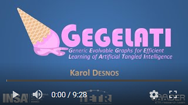
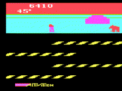
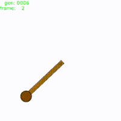

# 
_Generic Evolvable Graphs for Efficient Learning of Artificial Tangled Intelligence_

<a href="http://www.youtube.com/watch?feature=player_embedded&v=t0Ta5Vo5h7s
" target="_blank"></a>

GEGELATI _\[dʒedʒelati\]_ is a fresh open-source reinforcement learning framework for training artificial intelligence based on [Tangled Program Graphs (TPGs)](http://stephenkelly.ca/research_files/Kelly-Stephen-PhD-CSCI-June-2018.pdf). The purpose of this framework, developed as a C++ shared library, is to make it as easy and as fast as possible and to train an agent on a new learning environment. The C++ library is developed to be portable, fully documented, and thoroughly unit tested to ensure its maintainability. GEGELATI is developed at the Institute of Electronics and Telecommunications-Rennes (IETR).

## Overview
* [:gear: Continuous Integration](#gear-continuous-integration)
* [:framed_picture: Application Gallery](#framed_picture-application-gallery)
* [:hammer_and_wrench: Build and Install the Library](#hammer_and_wrench-build-and-install-the-library)
* [:book: How to Use the GEGELATI Library](#book-how-to-use-the-gegelati-library)
* [:balance_scale: License](#balance_scale-license)

## :gear: Continuous Integration

| All branches | [Travis Status](https://travis-ci.com/gegelati/gegelati) | [SonarCloud Analysis](https://sonarcloud.io/dashboard?id=gegelati_gegelati)[*](https://sonarcloud.io/organizations/gegelati/quality_gates/show/23677)|
| ------------- |  ------------- |  ------------- |
| master  |  [](https://travis-ci.com/gegelati/gegelati/branches)  | [](https://sonarcloud.io/dashboard?id=gegelati_gegelati&branch=master) [](https://sonarcloud.io/dashboard?id=gegelati_gegelati&branch=master)|
| develop  | [](https://travis-ci.com/gegelati/gegelati/branches) | [](https://sonarcloud.io/dashboard?id=gegelati_gegelati&branch=develop) [](https://sonarcloud.io/dashboard?id=gegelati_gegelati&branch=develop)|

## :framed_picture: Application Gallery
You can try GEGELATI with our (growing) set of open-source applications.

| [Atari Games](https://github.com/gegelati/ale-wrapper) | [Inverted Pendulum](https://github.com/gegelati/gegelati-apps) | [MNIST](https://github.com/gegelati/gegelati-apps) | [Tic Tac Toe](https://github.com/gegelati/gegelati-apps) |
|:-:|:-:|:-:|:-:|
|||||

Checkout the [gegelati-apps repository](https://github.com/gegelati/gegelati-apps) for more. If you have developed your own open-source learning environment and think it deserves to be listed here, don't hesitate to send us an e-mail.

## :hammer_and_wrench: Build and Install the Library
### Binaries
_Because being too lazy to build the library yourself is OK too._

Binaries of the library for windows (MSVC only) are available at the following links:
* [Release binaries](https://github.com/gegelati/gegelati/releases)
* [Develop neutral builds](https://gegelati.github.io/neutral-builds/)

To use these binaries, simply unzip them in a `lib` directory of your c++ project, and follow the "[How to Use the GEGELATI Library](#how-to-use-the-gegelati-library)" guide.

### Build tools
The build process of GEGELATI relies on [cmake](https://cmake.org) to configure a project for a wide variety of development environments and operating systems. Install [cmake](https://cmake.org/download/) on your system before building the library.

The GEGELATI code is annotated with the [doxygen](http://www.doxygen.nl/) syntax. Because having a proper code documentation is fundamental, its generation is a mandatory part of the build process. Install [doxygen](http://www.doxygen.nl/download.html) on your system before building the library.

### Hammer time!
To build the shared library (and its code documentation), you can execute the following commands:

```shell
git clone https://github.com/gegelati/gegelati.git
cd gegelati/bin
cmake ..
cmake --build . --target INSTALL # On Windows
cmake --build . --target install # On Linux
```

The shared library will be installed:
* On Windows: in the `gegelati/bin/gegelatilib-<version>` folder.
* On Linux, in the shared folders `/usr/local/lib/cmake/GEGELATI`, `/usr/lib/libGEGELATI.so.<version>`, `/usr/local/include/GEGELATI/`, and `/usr/local/share/doc/GEGELATI-<version>`.

## :book: How to Use the GEGELATI Library
### Learn by Examples
Since sometimes, a simple example is worth 10.000 pages of documentations, examples of applications built with the GEGELATI library are available in the [gegelati-apps repository](https://github.com/gegelati/gegelati-apps).

### Link to the library with CMake
To add GEGELATI to your c++ project, simply add the following lines to your`CMakeLists.txt` configuration:

```CMake
# *******************************************
# *********** GEGELATI LIBRARY **************
# *******************************************

if(WIN32)
	set(LIBS_DIR ${CMAKE_CURRENT_SOURCE_DIR}/lib)
    # find the gegelatilib-x.y.z folder in the lib directory.
	file(GLOB GEGELATI_ROOT_DIR "${LIBS_DIR}/gegelatilib-[\\.|0-9]*")
	set(ENV{GEGELATI_DIR} ${GEGELATI_ROOT_DIR})
endif()
find_package(GEGELATI)


if (WIN32)
	file(GLOB
		GEGELATI_DLL
		${GEGELATI_ROOT_DIR}/bin/*.dll
	)

	MESSAGE("Copy GEGELATI DLLs into ${CMAKE_RUNTIME_OUTPUT_DIRECTORY}")
	if(NOT ${CMAKE_GENERATOR} MATCHES "Visual Studio.*")
		file(COPY ${GEGELATI_DLL} DESTINATION ${CMAKE_RUNTIME_OUTPUT_DIRECTORY})
	else()
		file(COPY ${GEGELATI_DLL} DESTINATION ${CMAKE_RUNTIME_OUTPUT_DIRECTORY}/Debug)
		file(COPY ${GEGELATI_DLL} DESTINATION ${CMAKE_RUNTIME_OUTPUT_DIRECTORY}/Release)
	endif()
endif()
```
and (don't forget to replace YOUR_EXECUTABLE with... well, your executable name).
```CMake
target_link_libraries(YOUR_EXECUTABLE ${GEGELATI_LIBRARIES})
```

### Utilization Guide
_(10.000 pages of documentation (or less) coming soon...)_

## :balance_scale: License
This project is distributed under the CeCILL-C license (see [LICENSE file](LICENSE.txt)).
